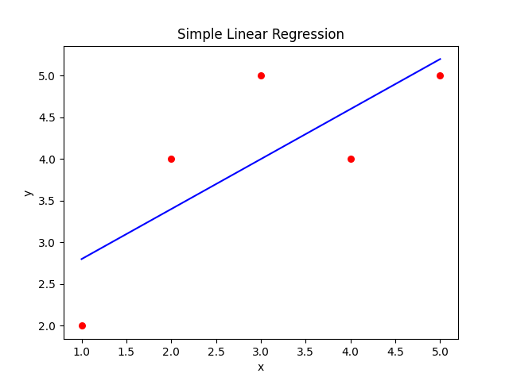

Here's the markdown version of your content with proper formatting:

---

# Understanding and Implementing Simple Linear Regression from Scratch

## Introduction

Hey there, are you ready to dive into another exciting journey? Today's adventure spot is Regression Analysis, a powerful tool for modeling relationships between variables. Our quest will be to explore the realm of Simple Linear Regression and implement it from scratch using Python!

Imagine being able to predict future outcomes based on specific parameters — exciting, isn't it? That's the magic of Regression Analysis! Let's gear up and embark on this journey with Simple Linear Regression, a storyline featuring two main characters: dependent and independent variables.

## Understanding Regression

Regression, a superstar in the world of statistics, finance, investing, and Machine Learning, is our guide to predicting future outcomes. In the grand world of regression, there are two central provinces: Simple Linear Regression and Multiple Linear Regression. Our map is marked to travel through the province of Simple Linear Regression.

To get you excited, let's take an example. Suppose you own a restaurant and want to predict your sales for the next week. You pull out your past data, relating your advertisement hours with sales details. Fancy predicting sales using advertisement data? Buckle up, as that's where we are heading!

## Basics of Simple Linear Regression

Within the kingdom of Simple Linear Regression, there's a strong belief that the two main characters (variables \(x\) and \(y\)) share a linear relationship. It's as though they're tied together with a magical linear thread. Here's a look at their relationship script:

\[
y = c + m \cdot x
\]

In this script:

- \(c\) represents the Y-intercept,
- \(m\) depicts the slope of the line,
- \(y\) is our dependent variable (what we want to predict), and
- \(x\) is the independent variable (the cause of the prediction).

All of this might sound like magic, but it's rooted in mathematical reality, which brings us to the next chapter of our journey.

## Mathematical Basis of Simple Linear Regression

The magical formula governing Simple Linear Regression revolves around minimizing residuals. Imagine residuals as the distance between the actual and predicted values of the dependent variable.

Let's uncover these magic spells:

\[
m = \frac{\sum_{i=1}^{N} (x_i - \bar{x})(y_i - \bar{y})}{\sum_{i=1}^{N} (x_i - \bar{x})^2}
\]

\[
c = \bar{y} - m \cdot \bar{x}
\]

In these formulas:

- \(N\) represents the number of data points,
- \(x_i\) refers to the x-coordinates of the points,
- \(y_i\) corresponds to the y-coordinates,
- \(\bar{x}\) and \(\bar{y}\) refer to the means of \(x\) and \(y\) values, respectively.

## Implementing Simple Linear Regression from Scratch

It's time to wield our magical Python wand to bring our theory to life. With Python, creating Simple Linear Regression from scratch feels nothing less than a magical incantation!

Let's see how we can implement this:

```python
import numpy as np

# Step 1: Get the data set
x = np.array([1, 2, 3, 4, 5])
y = np.array([2, 4, 5, 4, 5])

# Step 2: Compute the mean of X and y
mean_x = np.mean(x)
mean_y = np.mean(y)

# Step 3: Calculate the coefficients
m = np.sum((x - mean_x) * (y - mean_y)) / np.sum((x - mean_x)**2)
c = mean_y - m * mean_x

# Voila! We have our model
print(f"Model: y = {c} + {m}*x")  # Output: Model: y= 2.2 + 0.6*x
```

This Python program unfolds the equation of the line representing our simple linear regression model.

## Visualizing Linear Regression



Now, we can actually observe how the linear model represents the relationship within the data. Let's build the plot with this simple Python code:

```python
import matplotlib.pyplot as plt

plt.scatter(x, y, color="red", marker="o", s=30)  # s is marker size
y_pred = c + m * x
plt.plot(x, y_pred, color="blue")
plt.xlabel('x')
plt.ylabel('y')
plt.title('Simple Linear Regression')
plt.show()
```

### Explanation:

- The blue line is our 'best fit' through the data points - it represents the relationship between \(X\) and \(Y\) derived from the linear regression analysis.
  
How well does our model perform? By now, we can validate it by looking at the obtained 'best fit' line and seeing if it is close to the data points. In the further lessons, we will learn to evaluate the model's performance by computing different metrics.

## Lesson Summary and Practice

Hats off to you! You've successfully ventured through Regression Analysis by learning and implementing Simple Linear Regression from scratch using Python.

As we wrap up this magic show, let me tell you a secret — the real magic lies in practice! So, implement your newly acquired skills through some exciting exercises in our next segment. Let's spark more magic! Keep coding, and keep exploring!

--- 

This markdown version is formatted to clearly explain the concepts and code, making it easier to follow along and understand the lesson.